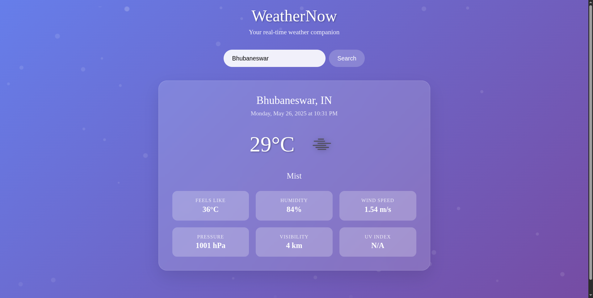

# 🌦️ WeatherApp

A simple and clean weather application built with HTML, CSS, and JavaScript that allows users to get real-time weather information for any city.



**Hosted online[Weatherapp](https://g-weather.infy.uk/)**

---

## ✨ Features

* **Current Weather:** Get up-to-date weather conditions including temperature, humidity, wind speed, and a weather description (e.g., sunny, cloudy, rain).
* **City Search:** Easily search for weather information for any city around the world.
* **Dynamic Icons:** Weather conditions are represented with intuitive icons.
* **Responsive Design:** The application is designed to work on various screen sizes, from desktops to mobile devices.
* **User-Friendly Interface:** Clean and intuitive design for easy navigation and understanding.

---

## 🛠️ Technologies Used

* **HTML5:** For the basic structure and content of the application.
* **CSS3:** For styling the user interface and making it visually appealing.
* **JavaScript (ES6+):** For fetching data from the weather API, handling user interactions, and dynamically updating the content.
* **OpenWeatherMap API** (or your chosen weather API): Used to fetch real-time weather data. *(Please confirm and specify the API you used)*

---

## 🚀 Getting Started

To get a local copy up and running, follow these simple steps:

1.  **Clone the repository:**
    ```bash
    git clone [https://github.com/Guru22073/WeatherApp.git](https://github.com/Guru22073/WeatherApp.git)
    ```
2.  **Navigate to the project directory:**
    ```bash
    cd WeatherApp
    ```
3.  **Open `index.html` in your browser:**
    Simply open the `index.html` file in your preferred web browser to start using the application.

---

## ⚙️ How It Works

1.  The user enters a city name in the search bar.
2.  JavaScript captures the input and makes an API call to a weather service (e.g., OpenWeatherMap API) with the city name.
3.  The API returns weather data in JSON format.
4.  JavaScript parses this data and dynamically updates the HTML to display the current temperature, weather condition, humidity, wind speed, etc. for the searched city.

---

## 📝 Future Enhancements (Optional)

* [ ] 5-day weather forecast
* [ ] Geolocation to automatically detect user's current location
* [ ] Unit conversion (Celsius/Fahrenheit)
* [ ] Save favorite locations

---

## 🤝 Contributing

Contributions, issues, and feature requests are welcome! Feel free to check the [issues page](https://github.com/Guru22073/WeatherApp/issues).

---

## 🙏 Acknowledgements (Optional)

* Thanks to [OpenWeatherMap](https://openweathermap.org/api) (or other API provider) for providing the weather data.

---

**Made with ❤️ by [Gurup/Guru22073](https://github.com/Guru22073)**
